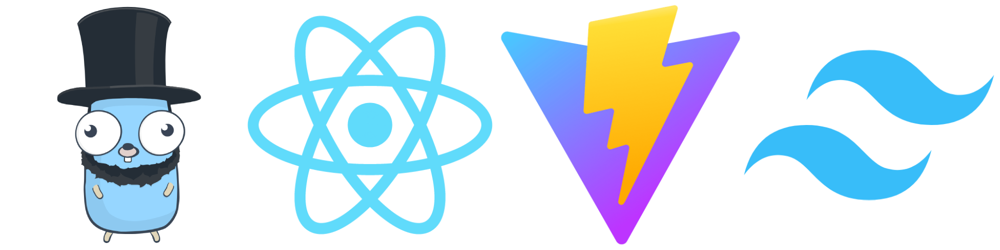

#


# Go, React, Tailwind and Vite template

By [benjamint08](https://github.com/benjamint08)

## Description

This is a template for a fullstack application using Go, React and Vite. This template application is a simple todo list.

## Features

- Go backend
- React frontend
- Tailwind CSS
- Vite for frontend development

## Installation

1. Clone the repository
2. Run `npm install`
3. Run `go run main.go -dev` for development
4. Run `go run main.go -build` to build the application
5. Run `go run main.go` to run the application in production mode

## Adding API endpoints

To add an API endpoint, create a new file in the `handlers` directory. Check the `handlers/todo_handlers.go` file for an example.

You can then add the handler to the router in the `main.go` file.

## File Handling API

This server now supports file uploads and downloads.

### Uploading a file

To upload a file, send a `POST` request to `/api/upload` with the file in a multipart/form-data form. The form field for the file should be named `file`.

Example using `curl`:
```bash
curl -X POST -F "file=@/path/to/your/file.txt" http://localhost:8080/api/upload
```

### Downloading a file

To download a file, send a `GET` request to `/api/download` with the `file` query parameter set to the name of the file you want to download.

Example using `curl`:
```bash
curl -o "downloaded_file.txt" http://localhost:8080/api/download?file=your_file.txt
```

## Production (Docker)

1. Run `docker build -t <your_image_name> .`
2. Run `docker run -d -p 8080:8080 <your_image_name>`
3. Visit `http://localhost:8080` in your browser
4. Success